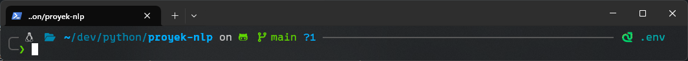

# Setup Virtual Environment Python for NLP in WSL

Tutorial ini menjelaskan cara setup virtual environment python untuk kebutuhan praktek NLP di Windows Subsystem Linux

## Langkah 1: Install Python dan PIP

jalankan command :

```bash
sudo apt update 
sudo apt install python3 python3-pip python3-venv -y
```

pastikan python dan pip terinstall

```bash
python3 --version
pip3 --version
```

jika sudah berhasil install akan muncul output:

```shell
> Python 3.12.3 #atau versi yang sesuai
> pip 24.0 from /path/to/file #atau versi yang sesuai
```

## Langkah 2: Buat folder proyek dan setup virtual environment

Jalankan command :

```bash
mkdir -p /path/to/nama-proyek
cd /path/to/nama-proyek
python3 -m venv env # <-- ganti env dengan nama yang anda mau
source ./env/bin/activate
```

Setelah itu python akan membuat virtual environment di folder proyek anda.

Jika berhasil, seharusnya shell akan masuk kedalam virtual environment. Contoh:

(disini saya menggunakan zsh dan powelevel10k, seharusnya tampilan akan kurang lebih sama)



atau

```shell
(env) username@DEKSTOP:~/path/to/project$
```

## Install requierements.txt dan Rigister Environment ke Jupyter

install requirements library yang diperlukan dengan menjalankan:

```bash
pip install -r requirements.txt
```

Lalu, daftarkan environtmen kedalam jupyter dengan menjalankan:

```bash
python -m ipykernel install --user --name=env --display-name "nama-proyek"
```

Catatan:


| Argumen        | Fungsi                                                                     |
| ---------------- | ---------------------------------------------------------------------------- |
| --user         | daftarkan kernel hanya untuk user sekarang                                 |
| --name=env     | nama root kernel, bisa diubah sesuai nama venv masing masing atau terserah |
| --display-name | nama proyek yang sedang dijalankan, bisa diganti sesuai keinginan          |

## Setup VSCode

Buka VSCode di dalam remote wsl lalu install ekstensi:

* ✔️ Python (Microsoft)
* ✔️ Jupyter (Microsoft)

Lalu tekan `ctrl+shift+p` -> ketik: `Pyton: Select Interpreter` pilih `Python 3.12.3 (env)` lalu reload window dengan `ctrl+shift+p` -> ketik: `Developer: Reload Window`.

## Done
Sekarang anda bisa menjalankan `.ipynb` langsung didalam vscode dengan environment yang terisolasi dan menggunakan kernel dari jupyter.

